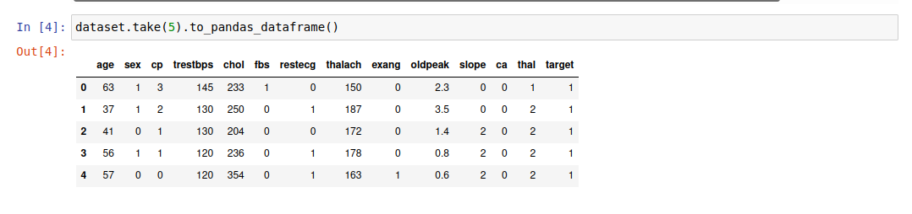

# Heart Disease Prediction
The current project uses machine learning to predict a heart disease in individuals depending on information we have about them, using data we  have about previous individuals.
We will be using Azure Machine Learning and Hyperdrive, after comparing we will choose the best model and deploy it in an Azure container instance to be served as an http endpoint.
The below illustration shows the roadmap of the project:


## Dataset
### Overview
We will be using a dataset about heart disease from [kaggle](https://www.kaggle.com/ronitf/heart-disease-uci)
* age: age in years
* sex: (1 = male; 0 = female)
* cp: chest pain type
* trestbps: resting blood pressure (in mm Hg on admission to the hospital)
* chol: serum cholesterol in mg/dl
* fbs: (fasting blood sugar &gt; 120 mg/dl) (1 = true; 0 = false)
* restecg: resting electrocardiographic results
* thalach: maximum heart rate achieved
* exang: exercise induced angina (1 = yes; 0 = no)
* oldpeak: ST depression induced by exercise relative to rest
* slope: the slope of the peak exercise ST segment
* ca: number of major vessels (0-3) colored by fluoroscopy
* thal: 3 = normal; 6 = fixed defect; 7 = reversible defect
* target: 1 or 0


### Task
The main task behind this project is to classify individuals whether they have a heart disease or not, we will be using 13 features and the 14th column labeled 'target', the original dataset has more than this, but most of the studies use these 14 features.

### Access
In order to access the dataset, I uploaded it to this github repository to make it publically accessible through a link and I created a dataset in Azure ML using Azure Python SDK.

## Automated ML

This problem is a classification problem, hence we use a classification task and the primary metric is Accuracy which we are trying to maximize.

We set up the experiment timeout to 30 minutes and the maximum concurrent iterations to 4.
To avoid overfitting, the early stopping turned on, the featurization setup to be automatic.

As we are saving the ONNX model, we set up compatibility to ONNX models to be True. We avoid the classification algorithms KNN and LinearSVM in this experiment.

### Results
The best Automated ML model generated the below results:
| Metric      | Value |
| ----------- | ----------- |
| Algorithm name  | VotingEnsemble        |
| Accuracy      | 0.86118       |
| AUC_weighted   | 100   |
The dataset is very small with just around 300 row, providing more data should improve the performance.

* The RunDetails widget


* The best model


## Hyperparameter Tuning
To address this problem of classification, we choose to use **Logistic Regression**. We tuning two hyperparameters which are **regularization** and **maximum number of iterations**, as the problem is a classification problem so I'm using **accuracy** as the primary metric. I set up the pipeline to run a maximum of 16 runs with a maximum of 4 in parallel.
 
The maximum number of iterations and the inverse regularization set up to take these below values:
 
```
{
       "--C" :        choice(0.001, 0.01, 0.1, 1, 10, 20, 50, 100, 200, 500, 1000), #inverse regularization
       "--max_iter" : choice(50, 100, 200, 300) # max iteration
}
```
 
I used Random Sampling which performs almost as the Grid Sampling and it necessits less time and resources. For early stopping I'm using Bandit Policy so we terminate runs that don't perform well, in our case we evaluate the runs each 100 iteration and discard runs covered by the slack_mount of 0.02.

**What are the benefits of the parameter sampler you chose?**
The random parameter sampler supports discrete values and values distributed over a continuous range, furthermore it gives almost the same performance as Grid sampling which consumes more time.

**What are the benefits of the early stopping policy you chose?**
Bandit is an early termination policy based on slack factor/slack amount and evaluation interval. The policy early terminates any runs where the primary metric is not within the specified slack factor/slack amount with respect to the best performing training run.

As explained in [microsoft documentation](https://docs.microsoft.com/en-us/python/api/azureml-train-core/azureml.train.hyperdrive.banditpolicy?view=azure-ml-py):
Consider a Bandit policy with slack_factor = 0.2 and evaluation_interval = 100. Assume that run X is the currently best performing run with an AUC (performance metric) of 0.8 after 100 intervals. Further, assume the best AUC reported for a run is Y. This policy compares the value (Y + Y * 0.2) to 0.8, and if smaller, cancels the run. If delay_evaluation = 200, then the first time the policy will be applied is at interval 200.

### Results
The best hyperdrive model generated the below results:
| Metric      | Value |
| ----------- | ----------- |
| Accuracy      | 0.934426       |
| Max iterations   | 100        |
| Inverse Regularization   | 10   |

* The RunDetails widget


* The best model


## Model Deployment
 
It's required to deploy just the best model between automl and hyperdrive but for the sake of learning I deployed both:

* **AutoML:**
 

Sample input:
```
data = json.dumps({
"data": [
  {
    "age": 63,
    "sex": 1,
    "cp": 3,
    "trestbps": 145,
    "chol": 233,
    "fbs": 1,
    "restecg": 0,
    "thalach": 150,
    "exang": 0,
    "oldpeak": 2.3,
    "slope": 0,
    "ca": 0,
    "thal": 1
  },
  {
    "age": 57,
    "sex": 0,
    "cp": 0,
    "trestbps": 140,
    "chol": 241,
    "fbs": 0,
    "restecg": 1,
    "thalach": 123,
    "exang": 1,
    "oldpeak": 0.2,
    "slope": 1,
    "ca": 0,
    "thal": 3
  }
]
})
```
Sample output:
```
[1, 0]
```
* **Hyperdrive:**
 

Sample input:
```
data = json.dumps(
  [[63, 1, 3, 145, 233, 1, 0, 150, 0, 2.3, 0, 0, 1],
   [57, 0, 0, 140, 241, 0, 1, 123, 1, 0.2, 1, 0, 3]]
)
```
Sample output:
```
[1, 0]
```
## Screen Recording

[Project presentation screencast](https://youtu.be/z_c2B2eaV7E)
The screencast demonstrates:
- A working model
- Demo of the deployed  models
- Demo of a sample request sent to the endpoint and its response
- Converting the model to ONNX model
- Enabling logging for the deployed web service

## Standout Suggestions

### Saving ONNX model:
* I set up AutoML to be compatible with ONNX to make it possible to save the best model in ONNX format. The steps for retrieving the model, saving and testing it are included in the automl notebook.

### Enabling logging
* To make troubleshooting and  monitoring our service easy I enabled logging for the deployed web service which is included in the hyperdrive notebook.
## References
* [Heart Disease UCI](https://www.kaggle.com/ronitf/heart-disease-uci)
* [Deploying an existing model in Azure](https://docs.microsoft.com/en-us/azure/machine-learning/how-to-deploy-existing-model)
* [Web Service invocation](https://docs.microsoft.com/en-us/azure/machine-learning/how-to-consume-web-service?tabs=python)
* [Enable web service logging](https://docs.microsoft.com/en-us/azure/machine-learning/how-to-enable-app-insights)
